# MyDevoirs :  La prise de devoirs sur ordinateur enfin simple !!!

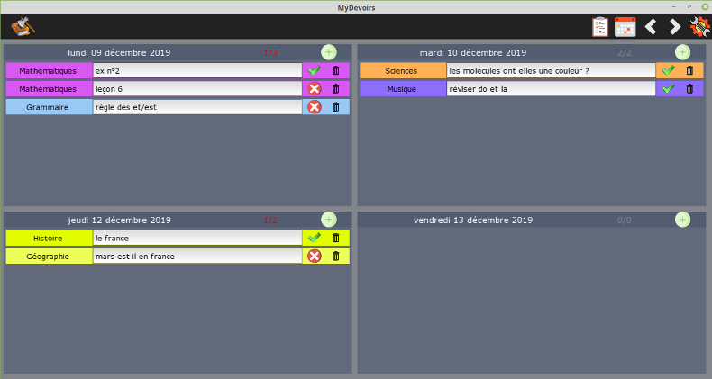

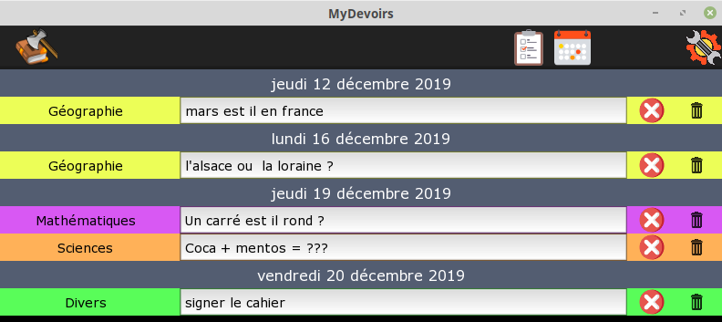


## Pourquoi MyDevoirs ?

Mon fils a un ordinateur à l'école depuis le CM1. Nous avons essayé beaucoup de solutions (rainlendar, onenote, agenda windows...), malheureusement rien de spécialement adapté pour parfaitement coller aux besoins d'un enfant. MyDevoirs a donc été développé spécialement pour lui, en accord avec ses besoins et ses exigences.

## MyDevoirs c'est pour qui ?

A priori les enfants qui ont besoin d'un ordiateur à l'école donc les Dys en général.

## Comment l'installer ?

Pour l'instant disponible sous Windows et Linux (Mac possible si quelqu'un le demande).

- Version Windows : [MyDevoirs.exe](https://github.com/jgirardet/mydevoirs/releases/download/0.6.3/MyDevoirs.exe) 
- Version Linux : [MyDevoirs](https://github.com/jgirardet/mydevoirs/releases/download/0.6.3/MyDevoirs)

	- puis sous Windows :
		- windows va vous mettre en garde car l'application n'est pas certifiée mais pas d'inquiétude, il suffit de cliquer sur `informations complémentaires` puis  `exécuter quand même`:

			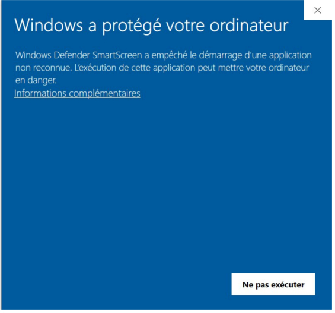 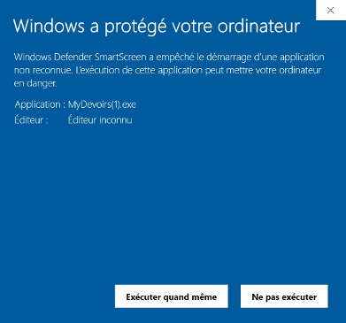

		- Ensuite il suffit d'éxécuter le fichier et c'est parti.

	- puis sous Linux :
		- Il faut rendre le fichier exécutable soit en mode terminal:
		```bash
		chmod +x MyDevoirs
		```
		ou en mode graphique, par exemple sous Mint :  click droit => propriétés => permissions => Autoriser l'exécution du fichier comme un programme.


## Comment l'utiliser ?

Il y a 2 interfaces possibles : Une interface  type `agenda`  qui affiche chaque jour de la semaine avec les devoirs de chaque jour, une autre type `todo list` (liste des tâches) . Il semble plus facile de noter ses devoirs dans le mode `agenda`, mais plus simple de faire ses devoirs en mode `todo list`. La `todolist` n'affiche que les devoirs non encore effectués alors que l'`agenda` affiche l'intégralité des devoirs.

Il est possible de modifier les jours affichés dans `Paramètres` .

En mode `agenda`, on change de semaine en cliquant sur  pour semaine suivante ou pour semaine précédente. 

### Pour ajouter un devoir:

On clique sur  et on choisit sa matière en cliquant dessus ou avec `entrée`.

La zone de texte est directement sélectionnée, pour entrer le texte correspondant.

### Pour marquer un devoir comme terminé:

On clique sur  qui devient . En mode `todo list`, la ligne disparaît de l'affichage.

### Pour supprimer un devoir:

On clique sur , il faut ensuite confirmer.

## C'est un peu long de reprendre la souris à chaque fois, des raccourcis claviers ce serait bien...

Les raccourcis claviers sont à utliser quand le curseur est dans une zone de texte.

 - `Ctrl+D` : (D = dupliquer) Pour créer une nouvelle ligne avec la matière en cours. Pratique quand on veut noter plusieurs choses de la même matière (par exemple leçons, exercices...).

 - `Ctrl+M` : (M = Matière) Pour changer la matière en cours. on peut se déplacer avec les `flêches` et valider son choix avec `entrée` ou la `flèche droite`.

 - `Ctrl+N` : (N = Nouveau) Pour créer une nouvelle ligne, le choix des matières s'affiche, on choisit avec les `flèches` et on valide par `entrée`.

 - `Ctrl+E`: (E = effacer) Pour effacer une ligne.


## Au secours j'ai un problème/ il manque une fonctionnalité

Il suffit de laisser un message/issue sur [Github issue](https://github.com/jgirardet/mydevoirs/issues). Il faut créer un compte github gratuit pour pouvoir laisser un message.


## Comment synchroniser MyDevoirs sur plusieurs ordinateurs ?

Il est parfois bien pratique d'avoir un double des devoirs de son enfant sur son propre ordinateur.
L'idée va être de synchoniser le fichier de base de données entre les 2 ordinateurs. Pour cela il faut avoir recours a une service tiers type DropBox, sugarsync, Seafile, Box...
Ensuite il vous suffit de mettre/choisir un fichier  dans un dossier qui sera synchronisé entre les différents ordinateurs.

JE PRECISE BIEN QUE CELA PERMET  DE SYNCHRONISER/SAUVEGARDER LA BASE DE DONNÉES MAIS EN AUCUN CAS DE TRAVAILLER EN MEME TEMPS.

IL EST DONC IMPORTANT, POUR UN MÊME FICHIER SYNCHRONISÉ, DE N'OUVRIR MYDEVOIRS QUE SUR UNE MACHINE À LA FOIS SINON UN RISQUE DE PERTE DE DONNÉES EST POSSIBLE.

 - tout d'abord cliquer sur le chemin actuel dans les paramêtres :

 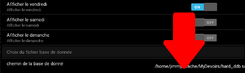

 - ensuite sélectionner le répertoire voulu et entrer un nouveau nom de fichier ou en selectionner un. Il est important que le chemin complet du fichier voulu apparaissent dans le zone de nom :

 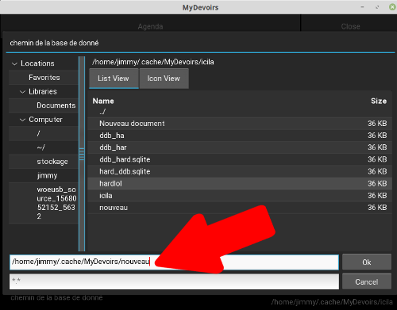

 - On vous demande ensuite si vous souhaitez ou non recopier le contenu de la base actuelle dans le nouveau fichier :

 

- Enfin une ultime confirmation si le fichier selectionné existait déjà :

 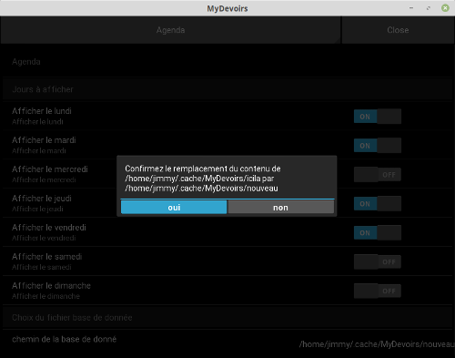

 - et voilà MyDevoirs va redémarrer depuis nouvelle base de donnée.

## Comment définir des couleurs personnalisées ?

Pensez bien à sauvegarder vos données ailleurs. Le changement de configuration peut rendre l'ancienne base inutilisable.
En cas de problème, il faut effacer la base existante ou choisir un nouveau fichier de configuration (cf synchro).

 - tout d'abord, il faut créer un fichier de configuration au format `json`. C'est assez simple il suffit de partir du model et de changer,
  les sections, les matières et les couleurs.
    - pour les couleurs : elle sont au format RGB et peuvent être obtenues ici : [W3 School color](https://www.w3schools.com/colors/colors_picker.asp).
    - attention en json chaque dernier élément d'une liste ne doit pas avoir de virgule (
    dans l'exemple c visible pour vocabulaire, géometrie, divers). C'est une erreur classique.
    - pour vérifier que le fichier est bien valide : le tester sur [jsonChecker](https://jsonchecker.com/) afin d'être sûr
    que tout est bon. 
    - sauvergarder votre fichier dans une endroit qui ne changera pas.

 - puis dans la zone `importer un fichier de configuration` dans les paramètres :

 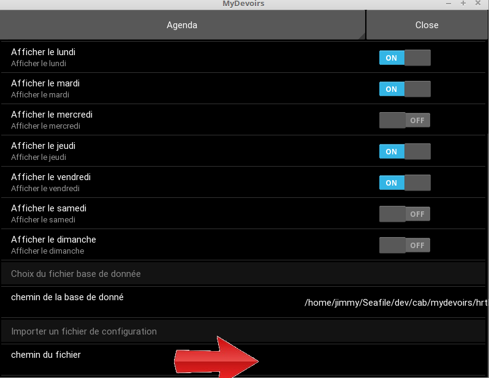
 
 - puis sélectionner le fichier et confirmer.
 
 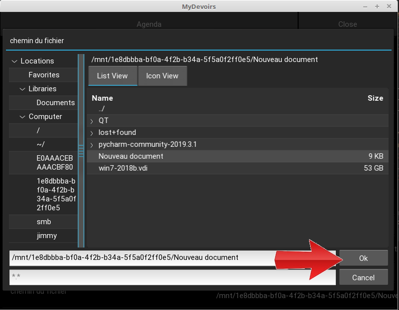

 
 
Pour annuler la sélection du  fichier de configuration :

 - tout d'abord cliquer dans la zone `importer un fichier de configuration` dans les paramètres :
 
 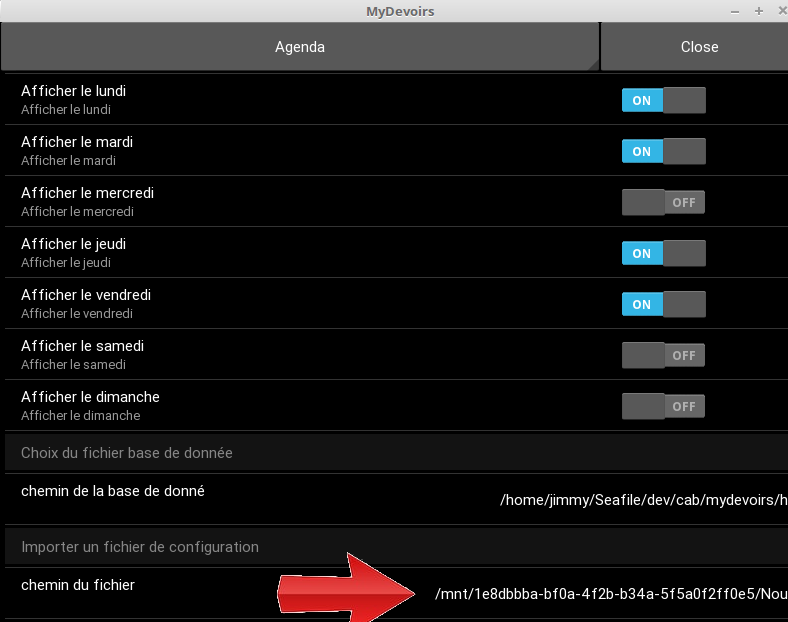
 
 - puis cliquer sur `Cancel` et confirmer son choix.
 
 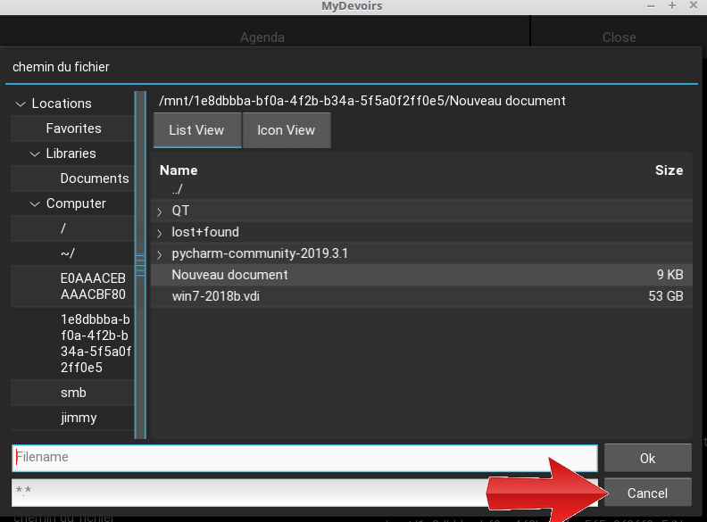

 

## MyDevoirs c'est gratuit ?

MyDevoirs est un logiciel libre (la code source est disponible) sous licence GPL3.

## Remeciements

Je remercie tous les gens impliqués dans la réalisation des technologies utlisées et plus particuliérement l'équipe de dévelopeurs de [Kivy](https://www.kivy.org) et [Ponyorm](https://ponyorm.org) pour leur disponibilité pour repondre aux questions.

## ChangeLog

- 0.7.0 :
    - ajout du lien d'aide
    - ajout de de la personalisation des couleurs et des matières.
    -  dev : ajout d'un mode debug et test pour ne pas mélanger les fichiers de configuration et la ddb.
